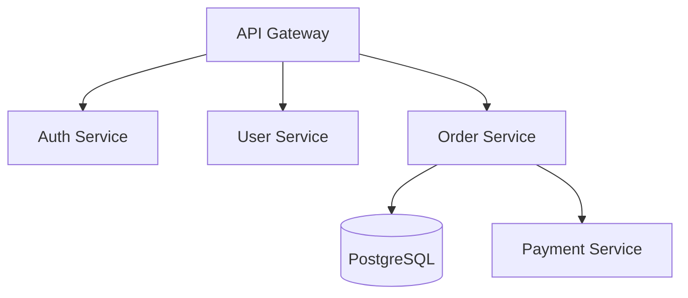

Para desenvolver com AI agents eficientemente, você precisa criar um repositório “AI-friendly” com documentação estruturada.

Se você ainda está tratando seu repositório como se fosse 2015 e espera que o Copilot, Cursor ou qualquer outro agent de IA faça mágica sem contexto, tenho uma notícia: eles vão gerar código tão confuso quanto aquele pull request das 3 da manhã que você fez na sexta-feira.

A verdade é que Large Language Models são como aquele estagiário super inteligente mas que precisa de contexto - sem documentação estruturada, ele vai alucinar mais que você após 4 Red Bulls tentando debugar um memory leak.

A boa notícia? Com alguns arquivos estratégicos no seu repo, você transforma qualquer LLM em um desenvolvedor que realmente entende seu projeto (e não, não estou falando de substituir devs, estou falando de ter um pair programming partner que não reclama do seu gosto musical duvidoso). Antes que você saia criando 47 arquivos markdown e transforme seu repositório em uma biblioteca digital, respira fundo: **nem tudo aqui precisa ser adotado**. Isso aqui não é dogma religioso, é um buffet de boas práticas - você pega o que faz sentido para o seu contexto.

Se você é SRE e está mais preocupado com runbooks e troubleshooting, foque nisso.

DevOps? Talvez queira caprichar no DEPLOYMENT.md.

Dev full-stack? ARCHITECTURE.md e CONVENTIONS.md podem ser seus melhores amigos.

O importante é criar *alguma* estrutura que permita que IAs (e humanos, esses seres esquecidos) entendam rapidamente o que diabos está acontecendo no seu código.

E sim, isso funciona para qualquer stack - desde aquele monolito Java legado até o microserviço em Rust que você jurou que ia aprender, mas ainda está “nos tutoriais”.

## Arquivos essenciais

### .cursorrules / .windsurfrules / .github/copilot-instructions.md

Instruções específicas para diferentes AI agents sobre como trabalhar no seu projeto:

```markdown
# Project Context
This is a microservices architecture using Node.js and TypeScript.
Follow clean architecture principles and domain-driven design.

# Code Style
- Use functional programming when possible
- Prefer composition over inheritance
- All functions must have JSDoc comments
- Use async/await over promises chains

# Testing
- Write tests for all business logic
- Use Jest for unit tests
- Minimum 80% coverage

# Naming Conventions
- camelCase for functions and variables
- PascalCase for classes and interfaces
- UPPER_CASE for constants
```

### **AI\_CONTEXT.md** (ou DEVELOPMENT.md)

Contexto completo do projeto para LLMs:

```markdown
# AI Development Context

## Project Overview
[Brief description of what the system does]

## Architecture
- **Type**: Microservices
- **Language**: TypeScript/Node.js
- **Database**: PostgreSQL + Redis
- **Message Queue**: RabbitMQ

## Domain Model
[Core entities and their relationships]

## Key Design Decisions
1. Why we use X instead of Y
2. Performance considerations
3. Security requirements

## Common Tasks
### Adding a new API endpoint
1. Create route in `src/routes/`
2. Add controller in `src/controllers/`
3. Add service logic in `src/services/`
4. Write tests in `__tests__/`

### Database migrations
Use `npm run migrate:create <name>`

## Anti-patterns to Avoid
- Don't use `any` type
- Avoid circular dependencies
- No business logic in controllers
```

### CONTRIBUTING.md

Guidelines para desenvolvimento:

```markdown
# Contributing Guide

## Branch Strategy
- `main` - production
- `develop` - development
- `feature/*` - new features
- `fix/*` - bug fixes

## Commit Convention
Follow Conventional Commits:
- `feat:` new feature
- `fix:` bug fix
- `docs:` documentation
- `refactor:` code refactoring
- `test:` adding tests

## PR Process
1. Create feature branch from `develop`
2. Write tests
3. Ensure CI passes
4. Request review from 2 team members
```

### CONVENTIONS.md

Convenções específicas do projeto:

````markdown
# Code Conventions

## File Naming
- Components: `PascalCase.tsx`
- Utilities: `camelCase.ts`
- Tests: `*.spec.ts` or `*.test.ts`

## Import Order
1. External libraries
2. Internal modules
3. Relative imports
4. Types/interfaces
5. Styles

## Error Handling
Always use custom error classes:
```typescript
throw new ValidationError("Invalid email format");
// NOT: throw new Error("Invalid email");
```

## Logging
Use structured logging:
```typescript
logger.info({ userId, action: "login" }, "User logged in");
```
````

### .aidigestignore / .aiignore

Arquivos que AI agents devem ignorar:

```markdown
node_modules/
dist/
build/
.env
*.log
coverage/
.git/
*.lock
package-lock.json
```

## Outros diretórios

### docs/ARCHITECTURE.md

O docs/ também é usado para armazenar toda documentação, sendo referenciada pelo readme.md ou numa estrutura melhor usando ASCIIDOCS (ao invés de markdown).

Obs.: coloque em seu backlog: “largar markdown e partir para asciidocs” para documentação “human friendly”.

No caso, um arquivo md para o diagrama da arquitetura detalhada com diagramas em formato Mermaid ou ASCII:

````markdown
# System Architecture

## Component Diagram


## Folder Structure
src/
├── domain/          # Business entities
├── application/     # Use cases
├── infrastructure/  # External concerns
└── interfaces/      # Controllers, routes
````

### diretório prompts/

Pasta com prompts reutilizáveis:

```markdown
prompts/
├── create-api-endpoint.md
├── add-database-migration.md
├── write-unit-tests.md
└── refactor-for-performance.md
```

Exemplo de create-api-endpoint.md:

````markdown
# Create New API Endpoint

## Context
You need to create endpoint: [ENDPOINT_PATH]
Method: [GET/POST/PUT/DELETE]
Purpose: [DESCRIPTION]

## Checklist
- [ ] Add route in `src/routes/`
- [ ] Create controller with input validation
- [ ] Implement service layer logic
- [ ] Add error handling
- [ ] Write OpenAPI documentation
- [ ] Create unit tests (>80% coverage)
- [ ] Add integration tests
- [ ] Update API documentation

## Validation Rules
[List expected validations]

## Response Format
```json
{
  "success": true,
  "data": {},
  "error": null
}
```
````

## README.md otimizado para AI

README com seções específicas:

````markdown
# Project Name

## Quick Start for AI Agents
```bash
npm install
cp .env.example .env
npm run migrate
npm run dev
```

## Project Structure
[Clear folder explanation]

## Key Commands
- `npm run dev` - Start development
- `npm run test` - Run tests
- `npm run lint` - Lint code
- `npm run build` - Build production

## Environment Variables
See `.env.example` for required variables

## API Documentation
Available at `/api/docs` when running

## Further Reading
- [ARCHITECTURE.md](docs/ARCHITECTURE.md)
- [AI_CONTEXT.md](AI_CONTEXT.md)
- [CONTRIBUTING.md](CONTRIBUTING.md)
````

## Práticas Recomendadas

### Documentação In-Code

```typescript
/**
 * Processes user payment with retry logic
 * 
 * @param userId - The user identifier
 * @param amount - Payment amount in cents
 * @returns Payment confirmation with transaction ID
 * @throws {InsufficientFundsError} When user has insufficient balance
 * @throws {PaymentGatewayError} When payment gateway is unavailable
 * 
 * @example
 * const result = await processPayment("user123", 1000);
 * console.log(result.transactionId);
 */
async function processPayment(userId: string, amount: number): Promise<PaymentResult> {
  // Implementation
}
```

### Schema/Type Definitions Centralizadas

```typescript
// src/types/user.types.ts
/**
 * User entity representing a system user
 * Used across authentication, profile, and order services
 */
export interface User {
  id: string;
  email: string;
  role: 'admin' | 'user' | 'guest';
  createdAt: Date;
}
```

### ADRs (Architecture Decision Records)

```plaintext
docs/adr/
├── 0001-use-typescript.md
├── 0002-microservices-architecture.md
└── 0003-event-driven-communication.md
```

Formato:

```markdown
# ADR 0001: Use TypeScript

## Status
Accepted

## Context
Need type safety and better developer experience

## Decision
Use TypeScript for all services

## Consequences
- Positive: Type safety, better IDE support
- Negative: Slightly longer build times
```

### Tests como Documentação

```typescript
describe('UserService', () => {
  describe('createUser', () => {
    it('should create user with valid email and return user ID', async () => {
      const result = await userService.createUser({
        email: 'test@example.com',
        password: 'SecurePass123!'
      });
      expect(result.id).toBeDefined();
    });

    it('should throw ValidationError for invalid email format', async () => {
      await expect(
        userService.createUser({ email: 'invalid', password: 'pass' })
      ).rejects.toThrow(ValidationError);
    });
  });
});
```

### OpenAPI/Swagger Specification

```yaml
# docs/openapi.yaml
openapi: 3.0.0
paths:
  /api/users:
    post:
      summary: Create new user
      description: Creates a user account with email validation
      requestBody:
        required: true
        content:
          application/json:
            schema:
              $ref: '#/components/schemas/CreateUserRequest'
```

## Ferramentas Complementares

1. **Cursor, Windsurf, Zed, Cline** - IDEs com AI integrada que leem esses arquivos
    
2. **GitHub Copilot Workspace** - Usa .github/[copilot-instructions.md](http://copilot-instructions.md)
    
3. **Aider** - CLI tool que se beneficia de boa estrutura de docs
    
4. **Sweep AI** - Bot que lê issues e cria PRs baseado na documentação
    
5. Estão criando mais “AI tools” que frameworks de JS, fique de olho em sites como [https://theresanaiforthat.com/](https://theresanaiforthat.com/) que sempre irá aparecer novos sites/SaaS (mas muito cuidado com early adopter, saiba colocar os riscos na balança antes de liberar o acesso ao seu codigo/repo de qualquer forma).
    

## Estrutura Recomendada Final

```plaintext
my-project/
├── .cursorrules
├── .aiignore
├── README.md
├── AI_CONTEXT.md
├── CONTRIBUTING.md
├── CONVENTIONS.md
├── docs/
│   ├── ARCHITECTURE.md
│   ├── API.md
│   ├── adr/
│   └── openapi.yaml
├── prompts/
│   ├── create-feature.md
│   └── debug-issue.md
├── src/
└── tests/
```

## Dicas para SRE

Como SRE, adicione também:

* **RUNBOOK.md** - Procedimentos operacionais para AI ajudar em incidents
    
* **MONITORING.md** - Métricas, alertas e dashboards
    
* **DEPLOYMENT.md** - Pipeline CI/CD e estratégias de deploy
    
* **TROUBLESHOOTING.md** - Problemas comuns e soluções
    

Esses padrões garantem que qualquer dev (ou AI agent) consiga entender rapidamente o contexto e contribuir consistentemente!